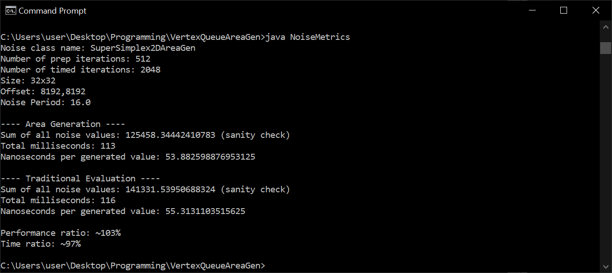
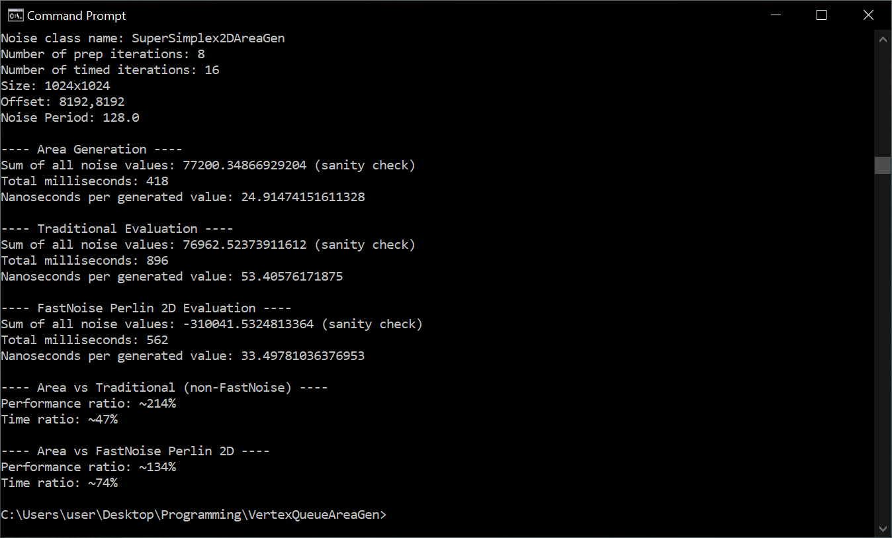

# Vertex Queue Area Generation for Gradient Noise
Proof of concept. Generates gradient noise over a specified area (using a vertex queue and not a "range"), with the goal of increasing performance.

The first idea I thought of, was to simply iterate over skewed lattice coordinates. But that wouldn't have been very good for generating slices of higher dimensional noise, unless you rotated the domain. There is also a company that wants to reserve it for themselves. I want to make sure everybody has access to speed-optimized gradient noise for whole-area generation, so I spent some time and came up with this instead.

## Algorithm
1. Define your image/buffer/array with a shape and size.
2. Use the frequency scaling (+ any other transforms) to pre-generate the contribution kernel.
3. Define the offset for the noise generation (e.g. if generating large tiles of an even larger world).
4. Start at one point on the image. I chose to start on the lowest corner. Skew the point into noise lattice coordinate space (including transforms such as frequency scaling).
5. Pick a nearby point/vertex on the skewed noise lattice. Add it to the queue and the "seen" set. The chosen point should either contribute directly to the image, or have at least one neighbor that does.
6. While the queue is not empty, loop:
	1. Pop off one point to process.
	2. Loop over and add its contribution anywhere necessary, to the image/array/buffer.
	3. For all of its defined "neighbors" (e.g. in 2D this could be the hexagon surrounding the point)
		1. If that neighbor is within contribution distance of the image/array/buffer, and is also not in the "seen" set, add it to the queue and set.

## Usage

### Demo
1. javac NoiseDemo.java
2. java NoiseDemo

### Your own project
1. Add SuperSimplex2DAreaGen to your project.
2. Initialize SuperSimplex2DAreaGen with a seed, and initialize SuperSimplex2DAreaGen.GenerateContext2D with a frequency scaling.
3. Define a 2D array of the form double[][] with a constant height and width.
4. Call generate(...) providing your array, context, and X/Y offsets.
	* The X/Y offsets are in image coordinate space. Generating an offset of (512, 0) while filling a 512x512 buffer will generate the tile adjacent to the one generated by (0, 0).

Notes:
* The array is not cleared when generate(...) is called. This means you will either need to clear it yourself, or initialize a new one. Otherwise, the generator will add its results to the existing values.
* The output can sometimes slightly exceed -1 and 1. While it is based off of a traditional evaluator that I believe was reasonably normalized, the grid-snapping of the pre-generated kernels introduces some slight variation in the results. Accounting for this dynamically depending on frequency, would have been more difficult than pre-computing a normalization constant. Though it is still an interesting problem.

## Results

### Noise

### Subtle differences compared to point evaluation.
The biggest performance improvement came from pre-generating the kernel function. The side effect is that it becomes snapped into alignment with the image pixel grid. In practice, the differences are not visible. But they can be visualized with direct comparisons to traditional point evaluation.

## Performance
Seems great for large areas (1024x1024 - 8192x8192) and low relative frequencies. Seems fine for moderately size areas (64x64) with high relative frequencies. Seems not very good for very small areas (16x16) and any frequency.

### Versus FastNoise (Non-SIMD)

## Possible extensions and related ideas
* Accept an amplitude scaling constant to better faciliate octave summation. The GenerateContext2D can bake this into the pre-generated kernel.
* Support domain rotation and independent axis scaling (arbitrary linear transforms). This example only includes a single frequency scaling for both axes.
* If using octaves, associate each point from the higher frequencies with one (nearest?) point from the lowest frequency, and process them all together.
* Write a 3D version (BCC or OpenSimplex)
* Try it with the torus trick in 4D. This technique should work better for that than iterating over skewed lattice coordinates. Will probably require re-parameterizing the kernel function.
* The above, but with various map projections such as geodesic dome tiles, cylindrical maps, etc. One could also define noise directly on a sphere, by determining a polyhedron (e.g. geodesic dome) whose vertices are assigned kernels not unlike the familiar ones, with gradients defined along whichever geometry is most practical. Though, vertex intransitivity may create visible artifacts.
* Support differently-shaped and differently-laid-out destination images/arrays/buffers. Hex grids, triangular sections of images, etc.
* This might not lend well to domain warping in general. However, if the amount of displacement is limited, then increasing the checked contribution radius by the maximum displacement should suffice.
* Should work just fine on a regular hypercube grid (Old Perlin) if necessary.
* Could probably experiment with only checking some of the neighbors, or checking more than just the direct neighbors, for some lattices. I imagine this decision is similiar to choosing between 4-point vs 8-point flood-fill from an efficiency standpoint.
* Evaluate to multiple images/arrays/buffers simultaneously, but with different seeds or other parameters.
* Group up points in hexes like [this](images/proposed_hex_groups.png?raw=true). Each hex is processed as one unit. Should work in higher dimensions too, just consider the vectors between centers of hexes and try to generalize those. Might improve efficiency by reducing queue and set invocations, and enable group contribution addition in a single loop.
* Perhaps pregenerate another sparse lattice (cubic, simplex, simplectic, or other) where each cell (plane-bounded, or voronoi, etc.) accumulates a list of contributing points for the region it covers. Then apply all of those points over that region.
* Try a pregenerated kernel of sufficient resolution on standard point-evaluation noise. I didn't see the speed improvements in this one until I pregenerated the kernel.
* Apply it to value-noise of some sort.

## Philosophy
This software is released under an open source license. With this license, you can use it for just about anything: independent projects, commercial projects, education, redistributable libraries, etc. That said, it is preferred that you not use it in the process of discovering and patenting computing ideas. Obviously, I cannot stop you from doing so. But I would invite you to consider the impact that computing idea patents ("software patents") have on the rest of the community.

Software patents prevent others from implementing an *idea* altogether, without conditions. This includes open source contributors, small game/software developers, and even educators. It includes anybody who arrives at an idea, independently or not. You don't necessarily need to be a classic "patent troll" for your software patent to create another obstacle in the avenue for creativity, and to inhibit progress as a whole.

You don't need software patents to protect your code. Copyright provides a lot of protection already. You can also keep your code closed-source, without using the patent system. Ask yourself if software patents are truly necessary for your business. I invite you to take a stand against them.

* http://endsoftpatents.org/
* http://en.swpat.org/wiki/Why_abolish_software_patents
* https://www.eff.org/deeplinks/2012/06/want-abolish-software-patents-tell-us
* https://www.wired.com/2015/02/eff-eliminate-software-patents/
